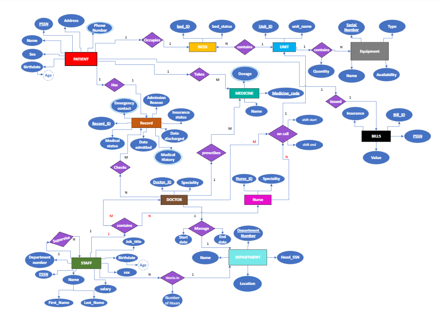

<h1> ICU Management System </h1>
 
A full stack project about ICU management system using HTML, CSS, Javascript, Bootstrap, Python, Flask, MySQL

 <h2> Objectives Reached: </h2>
 <li>Completed Frontend using HTML, CSS, Javascript, Bootstrap for each of: Doctor, patient, receptionist, patient, admin</li>
 <li>Created a database using MySQL</li>
 <li>Distributed privilage for each of: Doctor, patient, receptionist, patient, admin</li>
 <li>Almost completed backend using python and flask </li>
 <li>Created an ER model sketch:</li>

## Acknowledgments

I would like to express my gratitude to the following contributors who have made valuable contributions to this project:

| Contributor | GitHub Profile |
| --- | --- |
| Mariam Gamal | [@mariamgamal70](https://github.com/mariamgamal70) |
| Nada Alfowey | [@NadaAlfowey](https://github.com/NadaAlfowey) |
| Hassan ElSheikh | [@hassanelsheikh](https://github.com/hassanelsheikh) |

Thank you for your support and collaboration!
